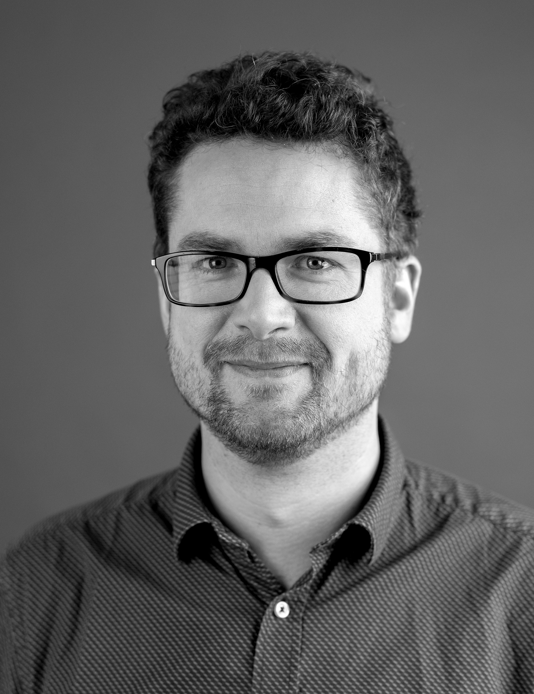

I am Adjunct Associate Professor in Computational Mathematics at the [Department of Mathematical Sciences](https://www.chalmers.se/sv/institutioner/math/Sidor/default.aspx) at [Chalmers University of Technology](https://www.chalmers.se/sv/Sidor/default.aspx) and [University of Gothenburg](https://www.gu.se), and Senior Radar Systems Engineer at [Saab](https://www.saab.com). 

My current research topic conserns the use of deep learning to obtain accelerated and scalable algorithms for computationally challenging problems. More precisely, I work on deep learning for non-linear filtering, optimal control, Bayesian statistics, solving PDE and radar signal processing. 

In my previous research I worked on stochastic differential equations, in particular numerical analysis, solution theory and Malliavin calculus for stochastic partial differential equations. When I define new research topics I try to find synergies with my old research field.

Here you find my [Official Chalmers page](https://www.chalmers.se/sv/personal/Sidor/adam-andersson.aspx), [Google Scholar profile](https://scholar.google.se/citations?user=LzPSY_YAAAAJ&hl=sv) and [LinkedIn profile](https://www.linkedin.com/in/adam-andersson-61695462/).

E-mail: adam.andersson(at)chalmers.se


## Publications

### Preprints and submitted articles

- K. Bågmark, A. Andersson, S. Larsson, An energy-based deep splitting method for the nonlinear filtering problem, [arXiv:2203.17153](https://arxiv.org/pdf/2203.17153.pdf), 20 pages.	

- K. Andersson, A. Andersson, C. W. Oosterlee, Convergence of a robust deep FBSDE method for stochastic control, [arXiv:2201.06854](https://arxiv.org/pdf/2201.06854.pdf), 25 pages.	

- A. Andersson, A. Lang, A. Pettersson and L. Schroer, Finite element approximation of Lyapunov equations related to parabolic stochastic PDEs, [arXiv:1910.05261](https://arxiv.org/pdf/1910.05261.pdf), 37 pages.	
	
- A. Andersson and F. Lindner, Poisson Malliavin calculus in Hilbert space with an application to SPDE, [arXiv:1703.07259](https://arxiv.org/pdf/1703.07259.pdf), 48 pages.

### Journal articles

- A. Andersson, A. Jentzen and R. Kurniawan, Existence uniquness and regularity for stochastic evolution equations with irregular initial values, _J. Math. Anal. and Appl._ (2021).

- A. Andersson and F. Lindner, Malliavin regularity and weak approximation of semilinear SPDE with Lévy noise, _Discrete Continuous Dyn. Syst. Ser. B._ (2019), 4271--4294.

- A. Andersson, M. Hefter, A. Jentzen and R. Kurniawan, Regularity properties for solutions of infinite dimensional Kolmogorov equations in Hilbert spaces, _Potential Anal._ (2019), 347--379.

- A. Andersson, A. Jentzen, R. Kurniawan and T. Welti, On the differentiability of solutions of stochastic evolution equations with respect to their initial values, _Nonlinear Anal._ (2017), p. 128--161.

- A. Andersson and R. Kruse, Mean-square convergence of the BDF2-Maruyama and backward Euler schemes for SDE with globally monotone coefficients, _BIT Numer. Math._ (2017), 21--53.

- A. Andersson, M. Kovács and S. Larsson, Weak error analysis for semilinear stochastic Volterra equations with additive noise,  _J. Math. Anal. Appl._ (2016), 1283--1304.

- A. Andersson, R. Kruse and S. Larsson, Duality in refined Sobolev-Malliavin spaces and weak approximation of SPDE, _J. SPDE Anal. Comp._ (2016), 113--149.

- A. Andersson and S. Larsson, Weak convergence for a spatial approximation of the nonlinear stochastic heat equation, _Math. Comp._ (2016), p. 1335--1358.

### Lecture notes
- A. Andersson and P. Sjögren, [Ornstein-Uhlenbeck theory in finite dimensions](http://www.math.chalmers.se/Math/Research/Preprints/2012/12.pdf), Chalmers, 2012.


## Bio

### Positions

- 2021-ongoing:  [Chalmers University of Technology](https://www.chalmers.se/sv/institutioner/math/Sidor/default.aspx), Adjunct Associate Professor.
- 2020-ongoing:  [Saab Surveillance](https://www.saab.com/products/air/airborne-surveillance), Radar Systems Engineer.
- 2019-2020: [Smartr](https://smartr.se), Chief Scientist and consultant.
- 2016-2019: [Syntronic](https://www.syntronic.com), Team Leader and consultant.
- 2015-2016: [TU Berlin](https://www.tu-berlin.de/?9003), Postdoctoral researcher.
- 2009-2015: [Chalmers University of Technology](https://www.chalmers.se/sv/institutioner/math/Sidor/default.aspx), PhD student. 

### Degrees
- 2021: Chalmers University of Technology, Associate Professor (Docent) in Computational Mathematics.
- 2015: Chalmers University of Technology, PhD in Mathematics. [Thesis](PhD_thesis.pdf)
- 2009: Chalmers University of Technology, MSc in Engineering Mathematics. [Thesis](master_thesis.pdf)
- 2006: Chalmers University of Technology, BSc in Automation and Mechatronics.

## Supervision

### PhD student

- **Kasper Bågmark** is working on deep learning for the nonlinear filtering problem. The aim is to obtain approximate filters that scale much better than particle filters. It is an academic project financed by the Wallenberg AI, Autonomous Systems and Software Program. Kasper belongs to the mathematics for AI research school. He started in August 2020.

### Master student

- **Mika Persson** is working on deep learning accelerated Bayesian inference for the direction of arrival problem.

### Previous master thesis students

- **Kristoffer Andersson** [Approximate stochastic control based on deep learning and forward backward stochastic differential equations](https://odr.chalmers.se/bitstream/20.500.12380/256458/1/256458.pdf), Chalmers/Syntronic. Kristoffer continued as a PhD student in machine learning for mathematical finance at Centrum Wiskunde Informatica, Amsterdam.
- **Robin Andersson** [Sparse representation and image classification with the shearlet transform](https://odr.chalmers.se/bitstream/20.500.12380/251854/1/251854.pdf), Chalmers/Syntronic. Robin continued as algorithm developer at Syntronic.
- **Viktor Blomqvist** and **David Lidberg** [Swedish dialect classification using artificial neural networks and Gaussian mixture models](https://odr.chalmers.se/bitstream/20.500.12380/251852/1/251852.pdf), Chalmers/Syntronic. Viktor continued as algorithm developer at Syntronic and David as machine learning engineer at RaySearch Laborarories.
- **Gustaf Ehn** and **Hugo Werner** [Scalable reinforcement learning for a simulated production line](https://lup.lub.lu.se/student-papers/search/publication/8936610), Lund University/Syntronic. Gustaf continued as algorithm developer at Syntronic and Hugo as data scientist at Stena Line and industrial PhD student in AI at KTH.
- **Klara Granbom** [On nonlinear machine learning methods for dose-response data in drug discovery](https://odr.chalmers.se/bitstream/20.500.12380/300963/1/Klara_Granbom_Master_Thesis.pdf), Chalmers/Smartr/IRLAB. Klara continued as a developer at Collector Bank. 
- **Elias Hölen Hannouch** and **Oskar Holmstedt** [Deep learning accelerated Bayesian estimation for state space models](https://odr.chalmers.se/bitstream/20.500.12380/301661/1/Master_s_Thesis_Elias_Oskar_.pdf), Chalmers/Smartr. Elias and Oskar continued to work as developers at Ericsson.
- **Anton Matsson** and **Victor Ohlsson** [Learning customer behavior with generative adversarial imitation learning](https://odr.chalmers.se/bitstream/20.500.12380/301319/1/Matsson_Olsson_2020.pdf), Chalmers/Smartr. Anton continued as a PhD student in AI at Chalmers and Victor as software engineer at Kollmorgen.
- **Axel Nathansson** [Exploration of reinforcement learning in radar scheduling](https://odr.chalmers.se/bitstream/20.500.12380/304144/1/MasterTHesis%20Axel%20Nathanson.pdf), Chalmers/Saab. Axel continued as algorithm developer at Tobii.
- **Leander Schroer** [Numerical approximation of operator Riccati equations for distributed control of SPDE](Leander_Official.pdf), TU-Berlin. Leander continued as a consultant at Sopra Steria Consulting.
- **Yueleng Wang** Efficient computation of the strong and weak error for linear SDE, Chalmers, 2014.

### Possible future master thesis projects 

- **Semi-definite programming for radar detection (industrial)** This project considers the radar detection problem from a another perspective, using so called atomic norms. It breaks down to a convex optimisation problem, more precisely, semi-definite programming. The framework is elegant but nontrivial, see this [paper](https://arxiv.org/pdf/1904.04283.pdf). A non-negligable part of the work will be theoretical, learning and formulating the theory in a detail level suitable for a master thesis. Besides this, the student will do numerical computations and make comparison with more classical approaches. Students should have a strong background in optimisation.

- **Exploring physics informed neural networks (industrial or academic)** Physics informed neural networks constitute the conceptually simplest class of deep learning solvers to partial differential equations. They are simple enough so that essentially no math skills are required. Therefore, the [original paper](https://faculty.sites.iastate.edu/hliu/files/inline-files/PINN_RPK_2019_1.pdf) has been cited 2900 times as of June 2022. Many of these papers are simply applications of the same method to various equations without much novelty. The purpose of the thesis is to understand different directions of physics informed neural networks, choose example equations to evaluate methods on, and investigate scaling to higher dimensions.

- **A novel training procedure for conditional generative models (academic)** This proposal concerns the learning of generative models. There are notions of weak and strong representations of probability distributions. For some problems it is easier to train the weak representation, but the strong is the desired (in generative models). The project concerns a two step procedure learning a weak representation first and from the weak representation training a strong representation. Elements of the approach are inspired by Wasserstein GAN. Students should have some experience with traing deep neural networks. The project is co-supervised by PhD-student Kasper Bågmark.

- **Adaptive sensor scheduling using deep reinforcement learning (industrial)** An Active Electrically Steered Antenna (AESA) can distribute its energy in a range of angles and can change direction without inertia. This freedom creates great opportunities to steer or control the use of the antenna in order to conduct the double task to both find new targets and to update tracked targets. The project is the continuation of this [thesis](https://odr.chalmers.se/bitstream/20.500.12380/304144/1/MasterTHesis%20Axel%20Nathanson.pdf) that was considering a too difficult problem to start with. We now have a new radar simulator at Saab that allows to simulate much simpler and less realistic settings in order to learn the difficulties. When it does realism can be increased.

- **Sticky PDMP sampler for Bayesian direction of arrival estimation** Bayesian statistics is powerful since it quantifies in the posterior the uncertainties in estimates. A dowside is that except in special cases, computing or sampling from the posterior is slow. The project concerns applying the method of this [paper](https://arxiv.org/abs/2103.08478) to the direction of arrival problem and compare it with other methods. 

### Other less well specified thesis topics that interest me are:

- Deep learning accelerated numerical schemes for Maxwell's equations.
- Signature based machine learning. See for instance this [paper](https://arxiv.org/abs/1905.08494) or this [master thesis](https://odr.chalmers.se/bitstream/20.500.12380/251852/1/251852.pdf).
- Learning operators for partial differential equations or Bayesian statistics. See for instance this [paper](https://arxiv.org/abs/1910.03193) or this [paper](https://arxiv.org/abs/2010.08895). 
- A continuous time formulation of the multi object target tracking problem (stochastic analysis).


## Presentations on YouTube

- Docent lecture 2020: [Riccati and Lyapunov equations for control and weak approximation of stochastic PDE](https://www.youtube.com/watch?v=VoePEMaH1X0&fbclid=IwAR31d7TRfh22S33A9Q331Z6dn3aEjDLL9tr3VTUff4bdLM2bqNXnrxvL88s), Chalmers.

- Gothenburg Artificial Intelligence Alliance 2020 conference: [Removing computational bottlenecks with deep learning](https://www.youtube.com/watch?v=hQBFStGj_jA).

- Gothenburg Artificial Intelligence Alliance MeetUp 2018: [Deep learning for equation solving and technical computations](https://www.youtube.com/watch?v=B9ugHg9Sy6g).


<!---


### Markdown

Markdown is a lightweight and easy-to-use syntax for styling your writing. It includes conventions for

```markdown
Syntax highlighted code block

# Header 1
## Header 2
### Header 3

- Bulleted
- List

1. Numbered
2. List

**Bold** and _Italic_ and `Code` text

[Link](url) and 
```

For more details see [GitHub Flavored Markdown](https://guides.github.com/features/mastering-markdown/).

### Jekyll Themes

Your Pages site will use the layout and styles from the Jekyll theme you have selected in your [repository settings](https://github.com/kadamandersson/kadamandersson.github.io/settings). The name of this theme is saved in the Jekyll `_config.yml` configuration file.

### Support or Contact

Having trouble with Pages? Check out our [documentation](https://docs.github.com/categories/github-pages-basics/) or [contact support](https://support.github.com/contact) and we’ll help you sort it out.

-->
