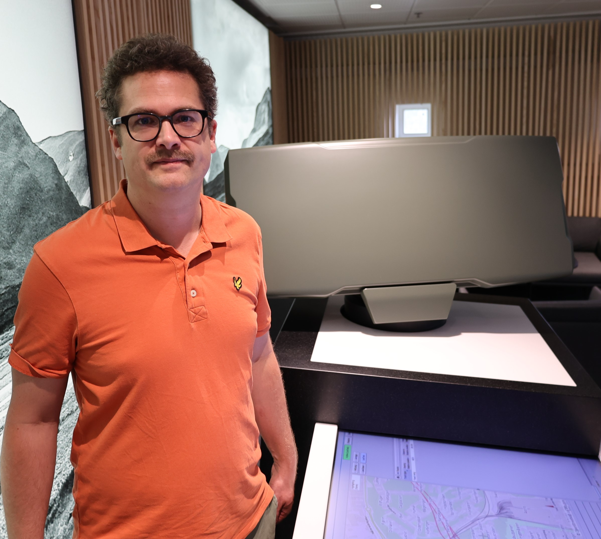

I am Adjunct Associate Professor in Computational Mathematics at the [Department of Mathematical Sciences](https://www.chalmers.se/sv/institutioner/math/Sidor/default.aspx) at [Chalmers University of Technology](https://www.chalmers.se/sv/Sidor/default.aspx) and [University of Gothenburg](https://www.gu.se) and Specialist in Engineering Mathematics at [Saab](https://www.saab.com). 

My current academic research concerns deep learning accelerated computational methods for nonlinear filtering, control and partially observabe Markov games. The goal is to push the boundaries for what can be filtered, controlled and played in real time. 

In my previous research I worked on stochastic differential equations, in particular numerical analysis, solution theory and Malliavin calculus for stochastic partial differential equations. 

In my specialist role at Saab I lead the development within the field of engineering mathematics in specific directions that I define. This consists in particular of investigating collaborations and funding oportunities for research studies or projects. 

Here you find my [Official Chalmers page](https://www.chalmers.se/sv/personal/Sidor/adam-andersson.aspx), [Google Scholar profile](https://scholar.google.se/citations?user=LzPSY_YAAAAJ&hl=sv) and [LinkedIn profile](https://www.linkedin.com/in/adam-andersson-61695462/).

E-mail: adam.andersson(at)chalmers.se

Image: Me and the Saab Giraffe 1X radar


## Publications


### Preprints and submitted articles	

<!--

- K. Andersson, A. A., C. W. Oosterlee, A robust deep FBSDE method for general FBSDE, 2024. [PDF](https://arxiv.org/pdf/TODO.pdf)

- A. A., S. Larsson, Riccati equations related to boundary control and filtering of SPDE, 2024. [PDF](https://arxiv.org/pdf/TODO.pdf)

-->

- K. Bågmark, A. A., S. Larsson, F. Rydin, A convergent scheme for the Bayesian filtering problem based on the Fokker-Planck equation and deep splitting, 2024. [PDF](https://arxiv.org/pdf/2409.14585)

- A. A., A. Lang, A. Pettersson and L. Schroer, Finite element approximation of Lyapunov equations related to parabolic stochastic PDEs, 2019. [PDF](https://arxiv.org/pdf/1910.05261.pdf)
	
- A. A. and F. Lindner, Poisson Malliavin calculus in Hilbert space with an application to SPDE, 2017. [PDF](https://arxiv.org/pdf/1703.07259.pdf)


### Journal articles

- K. Bågmark, A. A., S. Larsson, An energy-based deep splitting method for the nonlinear filtering problem, _Partial Differential Eq. Appl._ (2023). [PDF](https://arxiv.org/pdf/2203.17153.pdf)

- K. Andersson, A. A., C. W. Oosterlee, Convergence of a robust deep FBSDE method for stochastic control, _SIAM J. Sci. Comput._ (2023). [PDF](https://arxiv.org/pdf/2201.06854.pdf)

- A. A., A. Jentzen and R. Kurniawan, Existence uniquness and regularity for stochastic evolution equations with irregular initial values, _J. Math. Anal. and Appl._ (2021). [PDF](https://arxiv.org/pdf/1512.06899.pdf)

- A. A. and F. Lindner, Malliavin regularity and weak approximation of semilinear SPDE with Lévy noise, _Discrete Continuous Dyn. Syst. Ser. B._ (2019). [PDF](https://arxiv.org/pdf/1808.08574.pdf)

- A. A., M. Hefter, A. Jentzen and R. Kurniawan, Regularity properties for solutions of infinite dimensional Kolmogorov equations in Hilbert spaces, _Potential Anal._ (2019). [PDF](https://arxiv.org/pdf/1611.00858.pdf)

- A. A., A. Jentzen, R. Kurniawan and T. Welti, On the differentiability of solutions of stochastic evolution equations with respect to their initial values, _Nonlinear Anal._ (2017). [PDF](https://arxiv.org/pdf/1611.00856.pdf)

- A. A. and R. Kruse, Mean-square convergence of the BDF2-Maruyama and backward Euler schemes for SDE with globally monotone coefficients, _BIT Numer. Math._ (2017). [PDF](https://link.springer.com/content/pdf/10.1007/s10543-016-0624-y.pdf)

- A. A., M. Kovács and S. Larsson, Weak error analysis for semilinear stochastic Volterra equations with additive noise,  _J. Math. Anal. Appl._ (2016). [PDF](https://www.sciencedirect.com/science/article/pii/S0022247X1500832X)

- A. A., R. Kruse and S. Larsson, Duality in refined Sobolev-Malliavin spaces and weak approximation of SPDE, _J. SPDE Anal. Comp._ (2016). [PDF](https://arxiv.org/pdf/1312.5893.pdf)

- A. A. and S. Larsson, Weak convergence for a spatial approximation of the nonlinear stochastic heat equation, _Math. Comp._ (2016). [PDF](https://arxiv.org/pdf/1212.5564.pdf)


### Lecture notes
- A. A. and P. Sjögren, Ornstein-Uhlenbeck theory in finite dimensions, Chalmers, 2012. [PDF](http://www.math.chalmers.se/Math/Research/Preprints/2012/12.pdf)


## Supervision
<!--
### Open industrial master thesis projects

- **[Deep learning for stochastic differential games and distributed control](https://www.saab.com/career/job-opportunities/examensarbete-30hp-djupinlarning-for-stokastiska-differentialspel-och-distribuerad-styrning)** Supervised by [Per Ljung](https://scholar.google.com/citations?user=wI5Ft0wAAAAJ&hl=en) at Saab. 

- **[Diffusion models for generative modelling of a posteriori probability measures in target tracking](https://www.saab.com/career/job-opportunities/master-thesis-project-30-hp-diffusion-models-for-generative-modelling-of-a-posteriori-probability-measures-in-target-tracking1)** Supervised by [Jimmy Aronsson](https://scholar.google.se/citations?user=wz41154AAAAJ&hl=sv), Karl Hammar and [Benjamin Svedung Wettervik](https://scholar.google.se/citations?user=dwmcfd0AAAAJ&hl=sv) at Saab. 

### Open academic master thesis projects

- **[Deep learning for nonlinear filtering using backward stochastic differential equations](Deep_BSDE_masterthesis_proposal.pdf)**. Supervised by [Kasper Bågmark](https://bagmark.wordpress.com) at Chalmers.
-->

### PhD students

- **[Kasper Bågmark](https://bagmark.wordpress.com)** is working on deep learning for the nonlinear filtering problem. The aim is to obtain approximate filters that scale better than particle filters. It is an academic project financed by the Wallenberg AI, Autonomous Systems and Software Program (WASP). Jointly supervised with [Stig Larsson](https://www.math.chalmers.se/~stig/). I have defined the project and act main supervisor. 

- **[Mika Persson](https://www.chalmers.se/personer/mikape/)** is working on decentralized control of multi-function sensors. It is an industrial PhD position funded by Saab and WASP within the WASP Research Arena in Public Safety (WARA-PS). Jointly supervised with [Axel Ringh](https://sites.google.com/view/axelringh/home) and [Ann-Brith Strömberg](https://research.chalmers.se/person/anstr) at Chalmers and [Benjamin Svedung Wettervik](https://scholar.google.se/citations?user=dwmcfd0AAAAJ&hl=sv) at Saab. I have defined the project and am industrial supervisor.

- **Karl Hammar** will work on joint online system identification and state estimation for stochastic differential equations. It is an industrial PhD position funded by Saab and WASP. Jointly supervised with [Lennart Svensson](https://www.chalmers.se/personer/pale/) and [Moritz Schauer](https://www.math.chalmers.se/~smoritz/) at Chalmers and [Benjamin Svedung Wettervik](https://scholar.google.se/citations?user=dwmcfd0AAAAJ&hl=sv) at Saab. Benjamin has defined the project and I am industrial supervisor.

### Previous master thesis students

<!-- 

- **Oliver Spjuth** Target tracking with sparse transformers. Chalmers/Saab. Oliver Continued as target tracking analyst at Saab. 
 
-->

- **Oliver Spjuth** [Large scale target tracking using transformers](https://odr.chalmers.se/items/fae97993-c226-4598-8494-cbf2c0c84089). Chalmers/Saab 2024. Oliver contiued as a target tracking analyst and AI developer at Saab.
- **Alfred Wärnsäter** and **Viktor Nevelius Wernholm** [Efficient evaluation of target tracking using entropic optimal transport](https://odr.chalmers.se/server/api/core/bitstreams/3885a6e0-f649-4715-b3bf-80abc0be53fa/content). Chalmers/Saab 2024. Alfred continued as a PhD student in optimization at KTH and Viktor as a radar system engineer at Saab.
- **Filip Rydin** [A deep learning method for nonlinear stochastic filtering](https://odr.chalmers.se/server/api/core/bitstreams/fe337e49-537f-4848-b68f-7b0d90d05a77/content). Chalmers 2024. Filip continued as a PhD student in AI and optimal control at Chalmers.
- **Isak Wikman** and **Samuel Winqvist** [Prospects of neural SDE for Bayesian smoothing](https://odr.chalmers.se/server/api/core/bitstreams/25cab526-76e6-4adf-bb5f-27080febee7a/content). Chalmers/Saab 2024. Isak is finnishing the last courses of his master and Samuel continued as junior game mathematician at Thunderkick.
- **Emma Öijar Jansson** [Bayesian estimation of sea clutter
parameters for radar, a stochastic approach](http://kth.diva-portal.org/smash/get/diva2:1859981/FULLTEXT01.pdf). KTH/Saab 2023. Emma continued as a data scientist at ICA Sverige. 
- **Albin Ekelund Karlsson** and **Samuel Sandelius** [Adaptive radar illuminations with deep reinforcement learning](https://odr.chalmers.se/server/api/core/bitstreams/5c3ae2ce-cf71-4ebf-8541-7c08f36def56/content), Chalmers/Saab 2023. Albin continued as a consultant at AFRY and Samuel as a radar simulator developer at Saab.
- **Karl Hammar** [Fast Bayesian inference with piecewise deterministic Markov processes](https://odr.chalmers.se/server/api/core/bitstreams/177fa67a-1165-4037-8494-d13f7ccefb70/content), Chalmers/Saab 2023. Karl continued as a radar system engineer at Saab and later as industrial PhD student at Saab/Chalmers/WASP.
- **Mika Persson** [Towards deep learning accelerated sparse Bayesian frequency estimation](https://lup.lub.lu.se/luur/download?func=downloadFile&recordOId=9102407&fileOId=9102408), Lund University/Saab 2022. Mika continued as a radar systems engineer at Saab and later as industrial PhD student at Saab/Chalmers/WASP.
- **Axel Nathansson** [Exploration of reinforcement learning in radar scheduling](https://odr.chalmers.se/bitstream/20.500.12380/304144/1/MasterTHesis%20Axel%20Nathanson.pdf), Chalmers/Saab 2021. Axel continued as algorithm developer at Tobii.
- **Elias Hölen Hannouch** and **Oskar Holmstedt** [Deep learning accelerated Bayesian estimation for state space models](https://odr.chalmers.se/bitstream/20.500.12380/301661/1/Master_s_Thesis_Elias_Oskar_.pdf), Chalmers/Smartr 2020. Elias and Oskar continued to work as developers at Ericsson and Oskar later as a PhD student in biomathematics at Gothenburg University.
- **Anton Matsson** and **Victor Ohlsson** [Learning customer behavior with generative adversarial imitation learning](https://odr.chalmers.se/bitstream/20.500.12380/301319/1/Matsson_Olsson_2020.pdf), Chalmers/Smartr 2020. Anton continued as a PhD student in AI at Chalmers and Victor as software engineer at Kollmorgen.
- **Klara Granbom** [On nonlinear machine learning methods for dose-response data in drug discovery](https://odr.chalmers.se/bitstream/20.500.12380/300963/1/Klara_Granbom_Master_Thesis.pdf), Chalmers/Smartr/IRLAB 2020. Klara continued as a developer at Collector Bank. 
- **Kristoffer Andersson** [Approximate stochastic control based on deep learning and forward backward stochastic differential equations](https://odr.chalmers.se/bitstream/20.500.12380/256458/1/256458.pdf), Chalmers/Syntronic 2018. Kristoffer continued as a PhD student in machine learning for mathematical finance at Centrum Wiskunde Informatica, Amsterdam ([PhD Thesis](https://dspace.library.uu.nl/bitstream/handle/1874/433487/phdthesisfinal%20-%2065549cbcc4f23.pdf?sequence=1)).
- **Gustaf Ehn** and **Hugo Werner** [Scalable reinforcement learning for a simulated production line](https://lup.lub.lu.se/student-papers/search/publication/8936610), Lund University/Syntronic 2018. Gustaf continued as algorithm developer at Syntronic and Hugo as data scientist at Stena Line.
- **Robin Andersson** [Sparse representation and image classification with the shearlet transform](https://odr.chalmers.se/bitstream/20.500.12380/251854/1/251854.pdf), Chalmers/Syntronic 2017. Robin continued as algorithm developer at Syntronic.
- **Viktor Blomqvist** and **David Lidberg** [Swedish dialect classification using artificial neural networks and Gaussian mixture models](https://odr.chalmers.se/bitstream/20.500.12380/251852/1/251852.pdf), Chalmers/Syntronic 2017. Viktor continued as algorithm developer at Syntronic and David as machine learning engineer at RaySearch Laborarories.
- **Leander Schroer** [Numerical approximation of operator Riccati equations for distributed control of SPDE](Leander_Official.pdf), TU-Berlin 2016. Leander continued as a consultant at Sopra Steria Consulting.
- **Yueleng Wang** [Efficient computation of the strong and weak error for linear SDE](Yueleng.pdf), Chalmers 2014. Yueleng continued to study a second master in statistics at the University of Windsor.


## Presentations on YouTube

- Lecture for the appointment to associate professor 2020: [Riccati and Lyapunov equations for control and weak approximation of stochastic PDE](https://www.youtube.com/watch?v=VoePEMaH1X0&fbclid=IwAR31d7TRfh22S33A9Q331Z6dn3aEjDLL9tr3VTUff4bdLM2bqNXnrxvL88s), Chalmers.

- Gothenburg Artificial Intelligence Alliance 2020 conference: [Removing computational bottlenecks with deep learning](https://www.youtube.com/watch?v=hQBFStGj_jA).

- Gothenburg Artificial Intelligence Alliance MeetUp 2018: [Deep learning for equation solving and technical computations](https://www.youtube.com/watch?v=B9ugHg9Sy6g).


## Bio

### Positions

- 2023-ongoing:  [Saab](https://www.saab.com/products/air/airborne-surveillance), Specialist in Engineering Mathematics.
- 2021-ongoing:  [Chalmers University of Technology](https://www.chalmers.se/sv/institutioner/math/Sidor/default.aspx), Adjunct Associate Professor.
- 2020-2022:  [Saab](https://www.saab.com/products/air/airborne-surveillance), Radar Systems Engineer.
- 2019-2020: [Smartr](https://smartr.se), Chief Scientist and consultant.
- 2016-2019: [Syntronic](https://www.syntronic.com), Team Leader and consultant.
- 2015-2016: [TU Berlin](https://www.tu-berlin.de/?9003), Postdoctoral researcher.
- 2009-2015: [Chalmers University of Technology](https://www.chalmers.se/sv/institutioner/math/Sidor/default.aspx), PhD student. 

### Degrees
- 2021: Chalmers University of Technology, Associate Professor (Oavlönad Docent) in Computational Mathematics.
- 2015: Chalmers University of Technology, PhD in Mathematics. [Thesis](PhD_thesis.pdf)
- 2009: Chalmers University of Technology, MSc in Engineering Mathematics. [Thesis](master_thesis.pdf)
- 2006: Chalmers University of Technology, BSc in Automation and Mechatronics.

## Recreation

- [Älv, Bååth & Andersson](https://www.youtube.com/watch?v=2eacsONAWeg). A film by my paddling friend Jacob Kasprup Haagensen about a trip in the Vistas river in 2020. Shown at the Nordic Adventure Film Festival in Copenhagen 2022.

- [Kayaking in the Byske river 2019](https://www.youtube.com/watch?v=yyVUByskBdo). A film by my brother Arvid Bååth. 

<!---


### Markdown

Markdown is a lightweight and easy-to-use syntax for styling your writing. It includes conventions for

```markdown
Syntax highlighted code block

# Header 1
## Header 2
### Header 3

- Bulleted
- List

1. Numbered
2. List

**Bold** and _Italic_ and `Code` text

[Link](url) and 
```

For more details see [GitHub Flavored Markdown](https://guides.github.com/features/mastering-markdown/).

### Jekyll Themes

Your Pages site will use the layout and styles from the Jekyll theme you have selected in your [repository settings](https://github.com/kadamandersson/kadamandersson.github.io/settings). The name of this theme is saved in the Jekyll `_config.yml` configuration file.

### Support or Contact

Having trouble with Pages? Check out our [documentation](https://docs.github.com/categories/github-pages-basics/) or [contact support](https://support.github.com/contact) and we’ll help you sort it out.

-->
